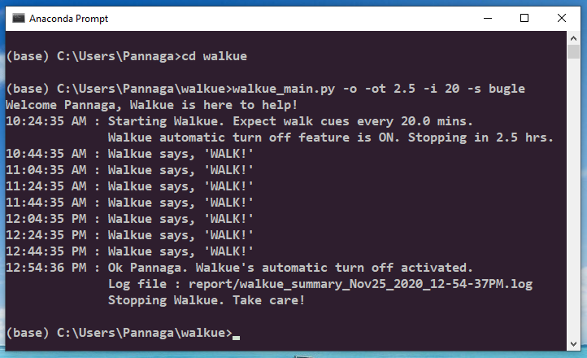

# Walkue - Health and wellness app
A Python application that sends the user, cues to get up and walk.

## Table of contents
1. [General Information](#general-information)
2. [Technologies](#technologies)
3. [Setup Information](#setup-information)
    * [Pre-requisites](#pre-requisites)
    * [Supported terminals](#supported-terminals)
    * [Launch commands](#Launch-commands)
4. [Features](#features)
    * [Default mode](#default-mode)
    * [Time interval setting](#time-interval-setting)
    * [Automatic turn off setting](#automatic-turn-off-setting)
    * [Automatic turn off time setting](#automatic-turn-off-time-setting)
    * [Sound cue selection](#sound-cue-selection)
    * [Realtime logging](#realtime-logging)
    * [User initiated exit handling](#user-initiated-exit-handling)
5. [Project Status](#project-status)
6. [References](#references)

## General Information
Sitting for long hours is clinically known to strain our body and mind. People worldwide, are spending more hours sitting - be it for work or for leisurely activity. Doctors recommend getting up every half an hour and walking for a few minutes before sitting down again.[[1]](#1)[[2]](#2)[[3]](#3)

My motivation to create Walkue, is to help break the habit of prolonged sitting. If you are glued to your desk and your laptop won't let go of you, let Walkue help you! Set how often you would like to get up from your seat. It could be any interval of time, whatever works for you. You will hear a sound[[4]](#4) cue when it's time for you to get up and walk. Just take the cue and WALK. The more steps you take, the better will be your health and focus.

Walkue's sound cues are short and effective without adding distraction. With no dependency on or distraction from smart phone or smart watch, you will not lose your train of thought while walking. A little change in perspective can help you come up with creative solutions.

See the setup information and launch commands and try Walkue today!

## Technologies
Python 3.7 on Windows 10

## Setup Information
### Pre-requisites
* Python 3.7
* Windows 10 OS
* Clone [this](https://github.com/pngrao/walkue) repo or download it to your Windows directory.

### Supported terminals:
* Windows command prompt
* Anaconda terminal
* Git Bash terminal

### Launch commands:
Enter walkue directory:
```
$cd walkue
```
To run in default mode:
```
$python walkue_main.py
```
To run in default mode with automatic turn off enabled:
```
$python walkue_main.py -o
```
For detailed help, run:
```
$python walkue_main.py -h
```
To quit, press:
```
ctrl+c
```

## Features
#### Default mode
By default, the time interval for sending walk cues is 30 mins and automatic turn off is disabled, thereby sending walk cues endlessly till the user quits.
```
$python walkue_main.py
```
#### Time interval setting
The user can choose a positive time interval in minutes, using the command line option '-i INTERVAL' or '--interval INTERVAL'. Eg:
```
$python walkue_main.py -i 50
```
#### Automatic turn off setting
By default, automatic turn off feature is off. Which means the user can quit by pressing ctrl+c. To turn it on, the user can direct Walkue to stop sending walk cues after a certain time, by using the flag '-o' or '--auto_off'. The default turn off time is 8 hours.
```
$python walkue_main.py -o
```
#### Automatic turn off time setting
The user can specify after how many hours Walkue should stop sending walk cues. As mentioned earlier by default that value is 8 hours. This can be changed with command line option '-ot AUTO_OFF_TIME' or '--auto_off_time AUTO_OFF_TIME'. Eg:
```
$python walkue_main.py -o -i 20 -ot 5
```
#### Sound cue selection
The user can let Walkue send sound cues at specific intervals of time. Use the option '-s {beep,bugle,buzzer}' or '--sound {beep,bugle,buzzer}' and select the sound that pushes or inspires or presses the user to get up and walk. Eg:
```
$python walkue_main.py -o -i 45 -ot 9.5 -s bugle
```
#### Realtime logging
The user is greeted with a welcome message. As per the user's preferences, Walkue sends sound cues. These are displayed as log messages on screen. When the process is complete, it exits with an informative message. A sample run output is below:

#### User initiated exit handling
At any point during the running time of Walkue, the user may exit the application by pressing ctrl+c. This is gracefully handled and the run concludes with an informative message.

## Project Status
Complete. New feature updates are planned.

## References
<a id="1">[1]</a> [What are the risks of sitting too much?](https://www.mayoclinic.org/healthy-lifestyle/adult-health/expert-answers/sitting/faq-20058005) Source: Mayo Clinic

<a id="2">[2]</a> [Why Is Sitting so Bad for Us?](https://www.yalemedicine.org/news/sitting-health-risks) Source: Yale Medicine

<a id="3">[3]</a> [Why sitting is bad for you - Murat Dalkilinç](https://www.youtube.com/watch?v=wUEl8KrMz14&t=2s) Source: TED-Ed

<a id="4">[4]</a> [Windows sound playing interface](https://docs.python.org/3.7/library/winsound.html) Source: Python3 Documentation

### Created by Pannaga Rao
